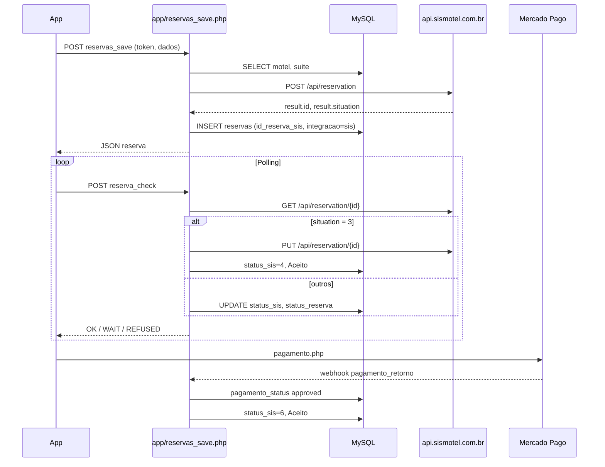
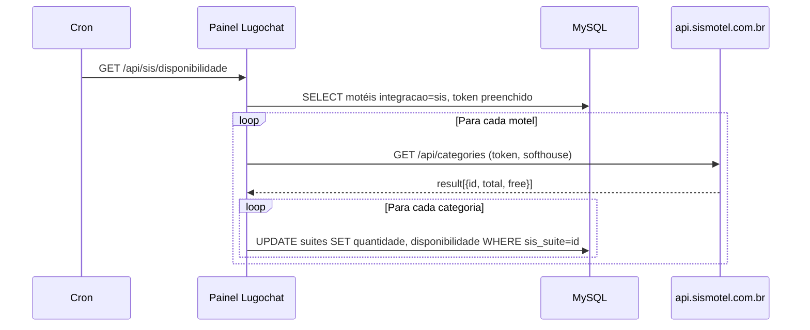
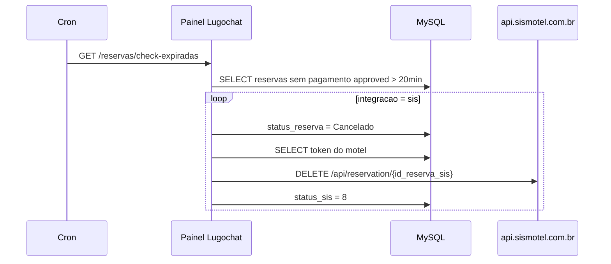

# Integração SIS (SISMOTEL) — Lugochat / Busca de Motéis

Documento de referência para replicar a integração com o **SIS** (`https://api.sismotel.com.br`) em outro painel. Descreve o que **este projeto implementa hoje**, onde está no código e quais contratos de dados/API são necessários.

---

## 1. Visão geral

O **SIS** (`https://api.sismotel.com.br`) é o PMS/ERP dos motéis. A integração está dividida em **duas camadas** neste repositório:

| Camada | Pasta | Papel |
|--------|-------|--------|
| **Painel admin** | `application/`, `view/`, `routes/` | Configurar motel/suíte, cron de disponibilidade, cron de expiração |
| **API do app mobile** | `app/` | Criar reserva no SIS, polling de status, pagamento Mercado Pago, cancelamentos |

```
┌─────────────────┐     POST /app/reservas_save.php      ┌──────────────┐
│  App Busca de   │ ───────────────────────────────────► │  SIS API     │
│  Motéis         │     GET/PUT/DELETE reservation       │  sismotel    │
└────────┬────────┘                                      └──────────────┘
         │
         │  reserva_check, pagamento, pagamento_retorno
         ▼
┌─────────────────┐     GET /api/sis/disponibilidade     ┌──────────────┐
│  MySQL          │ ◄─────────────────────────────────── │  Cron        │
│  reservas,      │     GET /reservas/check-expiradas    │  (servidor)  │
│  suites, users  │                                      └──────────────┘
└─────────────────┘
         ▲
         │  painel: cadastro motel, vínculo sis_suite
┌────────┴────────┐
│  Painel web     │
└─────────────────┘
```

Há três modos de integração por motel (`usuarios.integracao`):

| Valor | Significado |
|-------|-------------|
| `N` | Sem integração — `app/reserva_comum.php` |
| `api` | API interna Lugo — `app/reserva_api.php` + `application/Models/Api/` |
| `sis` | SISMOTEL — `app/reserva_sis.php` + arquivos deste documento |
PS: todas as suites ja estão como "sis"

Este documento detalha **`sis`** nas duas camadas.

---

## 2. Configuração global

Arquivo: `config/config.php`

```php
define('SIS_ATIVO', TRUE);
define('SIS_API', 'https://api.sismotel.com.br');
define('SIS_KEY', 'e630218300a03f94a4b6eaea5ef88afe-1f41ac68535aa65f6c74dd2548ef4e57');
define('SOFTHOUSE', 'c283ecc655bf074fc99ff95f1d51dc6c-721b224025ef117caabeaf76d58f3d50');
```

| Constante | Uso |
|-----------|-----|
| `SIS_ATIVO` | Se for TRUE esta ligado a integração com o SIS |
| `SIS_API` | Base URL de todas as chamadas HTTP ao SIS |
| `SIS_KEY` | o KEY de integração com o SIS (O KEY NÃO ESTA NA TABELA USUARIO, COMO É UM UNICO MOTEL ELE ESTA NO CONFIG.PHP) |
| `SOFTHOUSE` | Identificador da softhouse; enviado em **todo** request ao SIS no header `softhouse` |

---

## 3. Configuração por motel

### 3.1 Banco — tabela `usuarios` (tipo = 2, motel)

Campos relevantes:

| Campo | Tipo | Descrição |
|-------|------|-----------|
| `integracao` | ENUM `N`, `sis`, `api` | Deve ser `sis` para motéis SIS |
| `token` | string | Token do motel no SIS (header `token` nas APIs) |
| `status` | string | Apenas `'Ativo'` entra na sincronização |
| `tipo` | string | `2` = conta do motel |

### 3.2 Painel — formulário do motel

Arquivo: `view/pages/moteis/form.twig`

- Select **Sistema de Integração**: opção `Sistema Sis` → `integracao = sis`
- Campo **Token do Motel** → `token`

Critério usado no código para listar motéis SIS elegíveis:

```sql
SELECT * FROM usuarios
WHERE tipo = 2
  AND integracao = 'sis'
  AND token <> ''
  AND status = 'Ativo'

ISSO AQUI NÃO PRECISA O TOKEN ESTA NO config.php VEJA LA OS DADOS.
```

Implementação: `application/Models/Sis/Sis.php` → `getMotelSis()` / `getMotelSisSingle($id)`.

---

## 4. Vinculação de suítes (categorias SIS)

### 4.1 Banco — tabela `suites`

| Campo | Descrição |
|-------|-----------|
| `sis_suite` | ID da **categoria** no SIS (retorno de `/api/categories`) |
| `quantidade` | Total de unidades (`total` no SIS) |
| `disponibilidade` | Unidades livres (`free` no SIS) |

A sincronização atualiza `quantidade` e `disponibilidade` pelo par `(id_motel, sis_suite)`.

### 4.2 Painel — edição de suíte

Arquivos:

- `application/Controllers/Suites/SuitesController.php` — se `integracao == sis`, busca categorias
- `application/Services/Sis/CategoriesSis.php` — chama API SIS
- `view/pages/suites/form.twig` — bloco **Sistema SISMOTEL** (select + totais)
- `view/assets/js/pages/suites.js` — ao trocar categoria, preenche total/livre

Fluxo na edição:

1. Motel com `integracao = sis` e `token` preenchido
2. `GET {SIS_API}/api/categories` com headers `token` + `softhouse`
3. Lista categorias no `<select name="sis_suite">`
4. Operador escolhe a categoria e salva a suíte (`sis_suite`, `quantidade`, `disponibilidade`)

---

## 5. APIs do SIS consumidas pelo projeto

Todas usam **cURL** com os mesmos headers:

```
token: {token do motel}
softhouse: {SOFTHOUSE do config}
```

Em POST/PUT com body JSON, incluir também:

```
Content-Type: application/json
```

### 5.1 Listar categorias (disponibilidade por tipo de suíte)

| Item | Valor |
|------|-------|
| Método | `GET` |
| URL | `{SIS_API}/api/categories` |
| Usado em | Painel (`CategoriesSis.php`), cron disponibilidade |

Resposta esperada:

```json
{
  "result": [
    {
      "id": 123,
      "name": "Suíte Master",
      "total": 10,
      "free": 3
    }
  ]
}
```

Campos usados: `id`, `name`, `total`, `free`.

### 5.2 Criar pré-reserva no SIS

| Item | Valor |
|------|-------|
| Método | `POST` |
| URL | `{SIS_API}/api/reservation` |
| Usado em | `app/reserva_sis.php` |

Body JSON enviado (montado a partir do POST do app + `suites.sis_suite`):

```json
{
  "categories_id": 123,
  "period": 120,
  "tolerance": 15,
  "discount": 0,
  "value": "150.00",
  "value_receive": 0,
  "value_extra": 0,
  "charging": 1,
  "cpf_client": "11111111111",
  "name_client": "João Silva",
  "phone_client": "(11) 99999-9999",
  "email_client": "joao@email.com",
  "date_scheduled": "2025-11-28 22:00:00",
  "message": "BUSCA DE MOTEIS: abc12345",
  "note": "",
  "coupon": 0
}
```

| Campo | Origem no código |
|-------|------------------|
| `categories_id` | `suites.sis_suite` da suíte escolhida |
| `period` | Minutos — `converterParaMinutos(periodo_reserva)`; `"Pernoite"` → 720 min (12:00) |
| `date_scheduled` | `data_reserva` + `chegada_reserva` (com regra de pernoite 00h–04h → +1 dia) |
| `message` | `"BUSCA DE MOTEIS: {codigo_reserva}"` |

Resposta de sucesso esperada:

```json
{
  "success": true,
  "result": {
    "id": 456,
    "situation": 1
  }
}
```

Gravação local (`app/reserva_sis.php`):

- `id_reserva_sis` ← `result.id`
- `status_sis` ← `result.situation`
- `integracao` ← `'sis'`

### 5.3 Consultar reserva no SIS

| Item | Valor |
|------|-------|
| Método | `GET` |
| URL | `{SIS_API}/api/reservation/{id_reserva_sis}` |
| Usado em | `app/reserva_check_sis.php` |

Lê `result.reservation.situation` e mapeia para `status_reserva` local (ver seção 8.3).

### 5.4 Confirmar pré-reserva (PUT)

| Item | Valor |
|------|-------|
| Método | `PUT` |
| URL | `{SIS_API}/api/reservation/{id_reserva_sis}` |
| Usado em | `app/reserva_check_sis.php` |

Quando `situation == 3` (Pré-Reserva Confirmada):

1. `sleep(5)`
2. `PUT` na reserva (sem body)
3. Atualiza local: `status_sis = 4`, `status_reserva = 'Aceito'`

### 5.5 Cancelar reserva no SIS

| Item | Valor |
|------|-------|
| Método | `DELETE` |
| URL | `{SIS_API}/api/reservation/{id_reserva_sis}` |
| Usado em | `app/reserva_check.php`, `app/pagamento.php`, `app/pagamento_retorno.php`, cron `Reserva::checkReservasExpiradas()` |

Após cancelamento local, costuma gravar `status_sis = 8`.

> **Nota:** vários pontos não validam HTTP status nem body da resposta — apenas executam a requisição.

---

## 6. Endpoints expostos pelo painel (cron)

Arquivo de rotas: `routes/API/sis.php`

| Rota | Controller | Descrição |
|------|------------|-----------|
| `GET /api/sis/disponibilidade` | `SisController:disponibilidade` | Sincroniza **todos** os motéis SIS ativos |
| `GET /api/sis/motel/disponibilidade/{motel}` | `SisController:disponibilidadeMotel` | Sincroniza **um** motel (id do usuário/motel) |

Implementação: `application/Controllers/Sis/SisController.php`

### 6.1 Algoritmo de sincronização

Para cada motel SIS (ou o motel informado):

1. `getMotelSis()` / `getMotelSisSingle($id)`
2. `CategoriesSis::listCategories($token)`
3. Para cada item em `result[]`:
   - `Sis::updateDisponibilidade($id_motel, $suite)` onde:
     - `quantidade` ← `$suite['total']`
     - `disponibilidade` ← `$suite['free']`
     - UPDATE em `suites` WHERE `id_motel` AND `sis_suite = $suite['id']`

SQL do update (`application/Models/Sis/Sis.php`):

```sql
UPDATE suites
SET quantidade = :total, disponibilidade = :free
WHERE id_motel = :id_motel AND sis_suite = :sis_suite_id
```

Suítes **sem** `sis_suite` vinculado **não** são atualizadas.

### 6.2 Autenticação / acesso

Rotas sob `/api/` são **públicas** (sem login de painel):

`application/Middleware/Login/LoginCheckMiddleware.php` — qualquer URL contendo `api` é liberada.

**Recomendação para novo painel:** proteger esses endpoints com token de cron, IP allowlist ou auth básica — hoje qualquer um que souber a URL pode disparar a sync.

### 6.3 Cron sugerido

```bash
# A cada 1–5 minutos — todos os motéis SIS
curl -s "https://SEU-DOMINIO/painel/api/sis/disponibilidade"

# Ou por motel específico
curl -s "https://SEU-DOMINIO/painel/api/sis/motel/disponibilidade/42"
```

O endpoint **não retorna JSON** — resposta vazia em caso de sucesso.

---

## 7. Reservas e cancelamento automático (cron)

### 7.1 Campos em `reservas`

| Campo | Descrição |
|-------|-----------|
| `integracao` | `sis` quando a reserva veio do fluxo SIS (app) |
| `id_reserva_sis` | ID da reserva no SIS (obrigatório para cancelar) |
| `status_sis` | Status no SIS; `8` = cancelada após expiração local |
| `id_motel` | Motel da reserva |
| `status_reserva` | Pendente, Aceito, Recusado, Cancelado |

### 7.2 Cron de reservas expiradas

| Item | Valor |
|------|-------|
| Rota | `GET /reservas/check-expiradas` |
| Controller | `ReservaController:check_reservas_expiradas` |
| Model | `Reserva::checkReservasExpiradas()` |

Critérios (reserva é cancelada localmente):

- `status_reserva` **não** é `Recusado` nem `Cancelado`
- Pagamento **não** está `approved` (NULL ou diferente)
- `date_create` há mais de **20 minutos**

Para cada reserva expirada:

1. `status_reserva = Cancelado` (+ `notificao = yes` se existir coluna de push)
2. Se `integracao = api` → ajusta flags `fase_api`, `processado_api`, `cancelada_api`
3. Se `integracao = sis`:
   - Busca token: `Sis::getMotelSisSingle($id_motel)`
   - `DELETE {SIS_API}/api/reservation/{id_reserva_sis}`
   - `status_sis = 8`

Cron sugerido:

```bash
curl -s "https://SEU-DOMINIO/painel/reservas/check-expiradas"
```

Também liberado sem login (`check-expiradas` no middleware).

---

## 8. API do app mobile (`/app`)

Pasta **`app/`** na raiz do projeto — endpoints PHP legados consumidos pelo **app Busca de Motéis**. Todos incluem `../config/config.php`, aceitam **CORS** (`Access-Control-Allow-Origin: *`) e, na maioria, autenticam com:

```json
{ "token": "{TOKEN do config.php}" }
```

Body: JSON via `php://input` (exceto `pagamento.php` que usa `$_GET['codigo_reserva']` + POST).

Helpers em `config/functions_app.php`: `gerarCodigoPedido()`, `converterHoraPara24h()`.

### 8.1 Arquivos SIS-relevantes

| Arquivo | Função |
|---------|--------|
| `app/reservas_save.php` | **Entrada** — roteia por `motel.integracao` |
| `app/reserva_sis.php` | Cria reserva no SIS + INSERT local |
| `app/reserva_check.php` | Polling de status; inclui `reserva_check_sis.php` |
| `app/reserva_check_sis.php` | GET status SIS + PUT confirmação |
| `app/pagamento.php` | Mercado Pago; cancela SIS se pagamento falhar |
| `app/pagamento_check.php` | Verifica pagamento; cancela SIS se recusado |
| `app/pagamento_retorno.php` | Webhook MP; approved → SIS status 6; falha → DELETE |
| `app/reserva_comum.php` | Reserva sem integração (`integracao = N`) |
| `app/reserva_api.php` | Reserva integração API interna |

URLs típicas em produção:

```
https://SEU-DOMINIO/painel/app/reservas_save.php
https://SEU-DOMINIO/painel/app/reserva_check.php
https://SEU-DOMINIO/painel/app/pagamento.php?codigo_reserva=...
https://SEU-DOMINIO/painel/app/pagamento_retorno.php
```

### 8.2 Fluxo — criar reserva (`reservas_save.php`)

1. Valida `token == TOKEN` e campos obrigatórios (`motel`, `id_suite`, `id_usuario`, datas, valor…)
2. Gera `codigo_pedido` via `gerarCodigoPedido()`
3. Busca motel ativo
4. Despacha:

```php
if ($motel['integracao'] == 'N')  include('reserva_comum.php');
if ($motel['integracao'] == 'sis') include('reserva_sis.php');
if ($motel['integracao'] == 'api') include('reserva_api.php');
```

**`reserva_sis.php` em detalhe:**

1. Normaliza pernoite (00h–04h → data +1 dia; `periodo_pernoite = 1`)
2. Busca suíte → obtém `sis_suite`
3. `POST {SIS_API}/api/reservation`
4. Se `success === true`:
   - INSERT em `reservas` com `id_reserva_sis`, `status_sis`, `integracao = 'sis'`
   - Retorna array JSON com dados da reserva criada
5. Se falha → `{ "result": "error", "message": "..." }`

### 8.3 Fluxo — polling de status (`reserva_check.php` + `reserva_check_sis.php`)

**Entrada:** POST com `token`, `id_usuario`, `codigo_reserva`.

1. Carrega reserva + motel
2. Se `Pendente` há **> 10 minutos** → `status_reserva = Cancelado` (só local, neste passo)
3. Se `integracao == 'sis'` → `include('reserva_check_sis.php')`:
   - `GET /api/reservation/{id_reserva_sis}`
   - Mapeia `situation` → `status_reserva` via `getStatusSis()`:

| `status_sis` (situation) | Significado SIS | `status_reserva` local |
|--------------------------|-----------------|------------------------|
| 1 | Solicitação de Pré-Reserva | Pendente |
| 3 | Pré-Reserva Confirmada | Aceito (+ PUT confirma → 4) |
| 4, 6, 10, 11, 12, 15 | Pagamento / check-in / etc. | Aceito |
| 2, 5 | Pré-Reserva / Pagamento não registrado | Recusado |
| 7, 8, 9, 13, 14, 98, 99 | Cancelamentos / timeout / offline | Cancelado |

4. Resposta ao app:

| `status_reserva` | JSON |
|------------------|------|
| Aceito | `{ "result": "OK" }` |
| Recusado / Cancelado | `{ "result": "REFUSED" }` + DELETE SIS se `integracao = sis` |
| Pendente | `{ "result": "WAIT" }` |

### 8.4 Fluxo — pagamento Mercado Pago

**`pagamento.php`** — cartão/PIX via API Mercado Pago (`ACCESSTOKEN`).

- Grava/atualiza tabela `pagamentos`
- Se resposta MP com **erro** e motel `integracao = sis`:
  - `DELETE` reserva no SIS
  - `status_sis = 8`, `status_reserva = Cancelado`

**`pagamento_check.php`** — app consulta se pagamento saiu de `pending`.

- `pagamento_status !== pending` → `OK`
- `status_reserva == Recusado` → `REFUSED` + cancela SIS

**`pagamento_retorno.php`** — webhook Mercado Pago (`$_POST['data']['id']`).

| `pagamento_status` MP | Ação se `integracao = sis` |
|-----------------------|----------------------------|
| `approved` | `status_sis = 6`, `status_reserva = Aceito` |
| `rejected`, `cancelled`, `refunded`, `chargedback` | DELETE SIS, `status_sis = 8`, `Cancelado` |

> **Push de pagamento:** o fluxo `/reservas/check/pagamento` do painel depende de `pagamentos.pagamento_status = 'approved'` e `reservas.notificao = 'no'`. Os arquivos em `/app` **não** alteram `notificao` hoje — isso precisa ser feito no webhook ou em outro ponto ao aprovar pagamento.

### 8.5 Diagrama — reserva completa (app + SIS)



---

## 9. Mapa de arquivos no projeto

```
config/config.php                          → SIS_API, SOFTHOUSE, TOKEN, ACCESSTOKEN
config/functions_app.php                   → gerarCodigoPedido(), converterHoraPara24h()

# ── App mobile (API REST legada) ──
app/reservas_save.php                      → roteador de criação de reserva
app/reserva_sis.php                        → POST reserva no SIS + INSERT local
app/reserva_check.php                      → polling status + cancel local 10min
app/reserva_check_sis.php                  → GET/PUT status SIS + mapeamento
app/pagamento.php                          → Mercado Pago + cancel SIS em erro
app/pagamento_check.php                    → consulta status pagamento
app/pagamento_retorno.php                  → webhook MP + sync status SIS

# ── Painel admin (MVC) ──
routes/API/sis.php                         → cron disponibilidade
routes/pages/reservas.php                  → /reservas/check-expiradas

application/Controllers/Sis/SisController.php
application/Services/Sis/CategoriesSis.php
application/Models/Sis/Sis.php
application/Models/Reserva/Reserva.php     → cancelamento SIS + cron expiradas
application/Controllers/Reserva/ReservaController.php
application/Controllers/Suites/SuitesController.php

view/pages/moteis/form.twig                → integracao + token
view/pages/suites/form.twig                → sis_suite + quantidade/disponibilidade
view/assets/js/pages/suites.js
```

---

## 10. Diagrama — sincronização de disponibilidade



---

## 11. Diagrama — cancelamento por expiração (SIS)



---

## 12. Checklist para implementar em outro painel

### Configuração

- [ ] Constantes `SIS_API` e `SOFTHOUSE` no config
- [ ] Campo `integracao` no cadastro de motel (`sis`)
- [ ] Campo `token` por motel
- [ ] Campos `sis_suite`, `quantidade`, `disponibilidade` na tabela de suítes

### Disponibilidade

- [ ] Service `listCategories(token)` → GET `/api/categories`
- [ ] UI para vincular suíte local à categoria SIS
- [ ] Endpoint cron `GET /api/sis/disponibilidade` (todos os motéis)
- [ ] Endpoint opcional por motel
- [ ] UPDATE em suítes por `(id_motel, sis_suite)`

### App mobile (`/app`)

- [ ] `reservas_save.php` roteando por `integracao`
- [ ] `reserva_sis.php` — POST SIS + INSERT com `id_reserva_sis`, `status_sis`
- [ ] `reserva_check.php` + `reserva_check_sis.php` — polling e mapeamento `situation`
- [ ] PUT de confirmação quando `situation == 3`
- [ ] `pagamento_retorno.php` — sync `approved` → `status_sis = 6`
- [ ] DELETE SIS em recusa/cancelamento/erro de pagamento
- [ ] Autenticação app via `TOKEN` do config
- [ ] (Opcional) setar `notificao = 'no'` ao aprovar pagamento para push do painel

### Reservas / cron painel

- [ ] Colunas `integracao`, `id_reserva_sis`, `status_sis` em reservas
- [ ] App grava `id_reserva_sis` ao reservar no SIS
- [ ] Cron expiradas cancela no SIS (DELETE) + `status_sis = 8`
- [ ] Proteger endpoints de cron (recomendado)

### Segurança / operação

- [ ] Cron externo chamando URLs periodicamente
- [ ] Logs de falha cURL (hoje só execução silenciosa no cancelamento)
- [ ] Validar resposta HTTP do SIS em produção

---

## 13. Diferença rápida: integração `api` vs `sis`

| Aspecto | `api` | `sis` |
|---------|-------|-------|
| Config motel | `integracao = api` | `integracao = sis` + `token` |
| Sync disponibilidade | Motel/sistema externo chama `/api/integracao/...` | Cron chama SIS `/api/categories` |
| Reserva | Flags `fase_api`, `processado_api`, `cancelada_api` | `id_reserva_sis`, `status_sis` |
| Cancelamento expirada | Atualiza flags API | DELETE no SIS |
| Código principal | `Models/Api/`, `Controllers/Api/` | `Models/Sis/`, `Services/Sis/`, `Controllers/Sis/` |

Um motel usa **um** tipo por vez (`integracao` única).

---

## 14. Pontos de atenção (comportamento atual)

1. **`SisController::disponibilidade`** não retorna conteúdo — difícil monitorar sucesso no cron.
2. **`getCancelarReservaSis`** (painel e `/app`) não trata erro de rede ou 4xx/5xx do SIS.
3. Se `id_reserva_sis` for `0` ou vazio, o DELETE pode falhar silenciosamente.
4. Suítes sem `sis_suite` configurado nunca recebem sync — disponibilidade fica desatualizada.
5. **Tempos de expiração diferentes:** `app/reserva_check.php` cancela `Pendente` após **10 min**; cron painel `checkReservasExpiradas` usa **20 min** e exige pagamento não approved.
6. Endpoint `/api/sis/motel/disponibilidade/{motel}` envia CORS — útil para browser; cron não precisa.
7. **`pagamento.php`** referencia `$pagamento_status` no bloco de erro SIS, mas a variável pode não estar definida nesse contexto (possível bug).
8. **`reserva_check_sis.php`** re-busca a reserva no final do arquivo (linhas 103–106) após updates — código legado/confuso; validar ao portar.
9. **`/app` não altera `notificao`** — push de pagamento aprovado no painel exige `notificao = 'no'` em outro ponto.

---

## 15. Exemplo mínimo — service de categorias (PHP)

Referência equivalente a `CategoriesSis.php`:

```php
public function listCategories(string $token): array
{
    $curl = curl_init();
    curl_setopt_array($curl, [
        CURLOPT_URL => SIS_API . '/api/categories',
        CURLOPT_RETURNTRANSFER => true,
        CURLOPT_CUSTOMREQUEST => 'GET',
        CURLOPT_HTTPHEADER => [
            'token: ' . $token,
            'softhouse: ' . SOFTHOUSE,
        ],
    ]);
    $response = curl_exec($curl);
    curl_close($curl);
    return json_decode($response, true) ?: [];
}
```

---

## 16. Exemplo mínimo — cancelamento SIS (PHP)

Referência equivalente a `Reserva::getCancelarReservaSis`:

```php
public function cancelarReservaSis(int $idReservaSis, string $tokenMotel): void
{
    if ($idReservaSis <= 0 || $tokenMotel === '') {
        return;
    }
    $curl = curl_init();
    curl_setopt_array($curl, [
        CURLOPT_URL => SIS_API . '/api/reservation/' . $idReservaSis,
        CURLOPT_RETURNTRANSFER => true,
        CURLOPT_CUSTOMREQUEST => 'DELETE',
        CURLOPT_HTTPHEADER => [
            'token: ' . $tokenMotel,
            'softhouse: ' . SOFTHOUSE,
        ],
    ]);
    curl_exec($curl);
    curl_close($curl);
}
```

---

*Documento gerado com base no código do repositório Lugochat. Revise `SOFTHOUSE`, tokens e URLs ao portar para outro ambiente.*


# Disponibilidade (a cada 1–5 min)
curl -s "http://localhost/swing/api/sis/disponibilidade"

# Reservas expiradas (a cada 5 min)
curl -s "http://localhost/swing/reservas/check-expiradas"